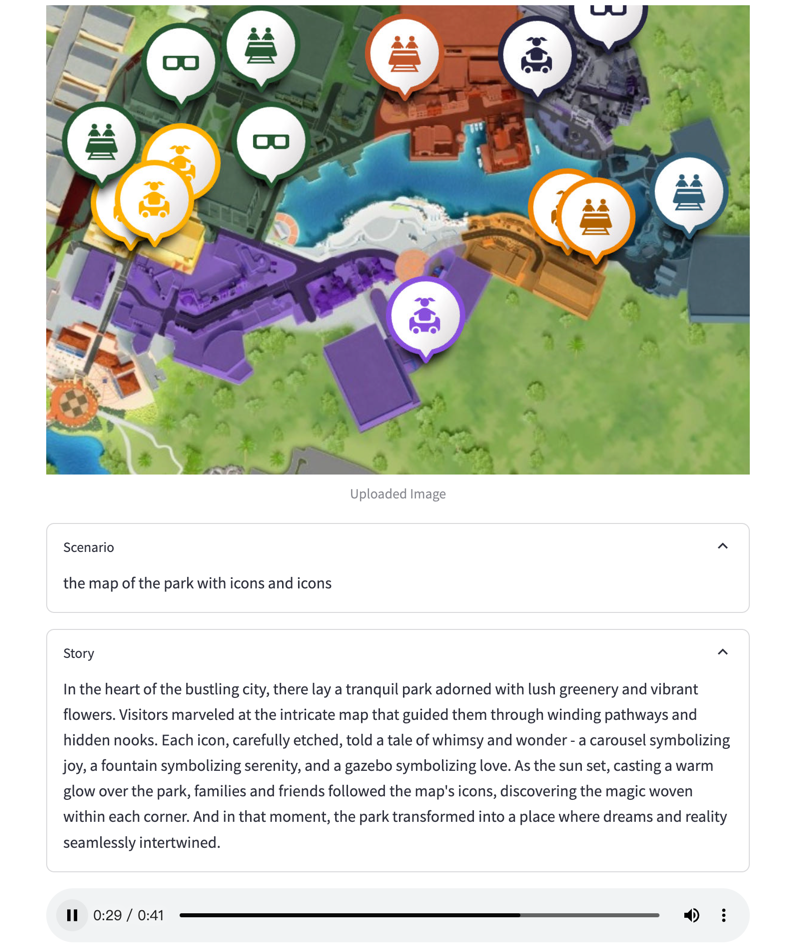

# Streamlit App with a Hugging Face Model

> Duke University IDS 721 Mini Project 9

## Demo: Turn Images into Audio Stories

## Requirements

- Create a website using Streamlit
- Connect to an open source LLM (Hugging Face)
- Deploy model via Streamlit or other service (accessible via browser)

## Preparation
1. Python 3.9 (3.8 is also fine)
2. Hugging Face Transformers
3. Streamlit
4. OpenAI API
5. Langchain API

## Description: 3 Step Process

Three models are used in this project: Two Hugging Face Models and OpenAI API. 

The first Hugging Face model is used to generate a description of the image,
then the OpenAI model is used to generate a story from the image,
finally the second Hugging Face model is used to generate an audio story from the story.

1. Upload an image by [Hugging Face]() model
2. Get a description of the image by [OpenAI]() model
3. Generate a story from the image by [Hugging Face]() model

## Run and Result

### Local Running
1. Clone this Repo
2. Run `streamlit run app.py`
3. Visit the app at `http://localhost:8501/`
4. Make sure you have the `openai` API key in your `.env` file
5. Make sure you have the `huggingface` API key in your `.env` file
6. Make sure you have port 8501 available
7. Upload an image and get the audio story

## Reference

1. https://huggingface.co/models
2. https://huggingface.co/Salesforce/blip-image-captioning-base
3. https://huggingface.co/espnet/kan-bayashi_ljspeech_vits
4. https://streamlit.io/
5. https://docs.streamlit.io/deploy/streamlit-community-cloud/get-started
6. https://openai.com/blog/openai-api
